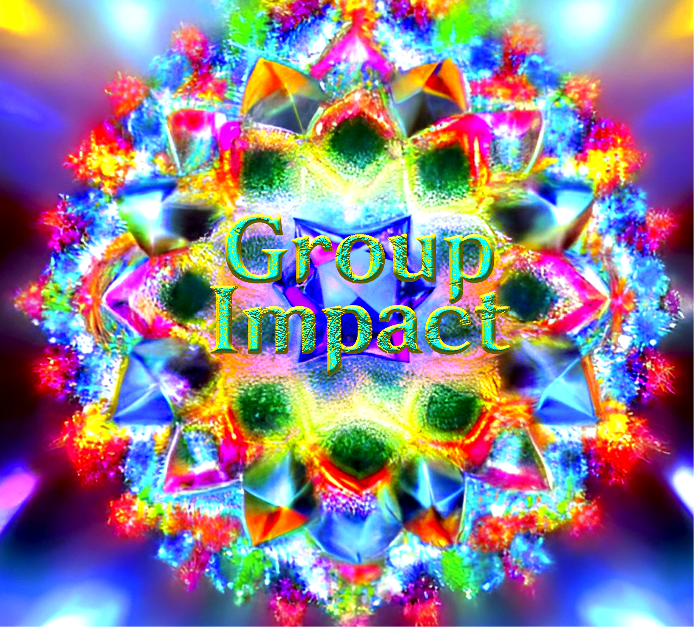

# GroupImpact: A 3D visualization tool on crystallographic groups based on PyVista

A 3D visualization tool that can help understand crystallographic groups in an interactive scene. Contents include basic point groups and crystallographic point groups using Schoenflies and Hermann-Mauguin symbols.

This tool is equipped with a GUI configured from PyQt5.

This version is only an individual test project, and I'm not sure about its compatibility. Feel free to provide suggestions and issues.

## Install

You can use Python3.9+ and pip to finish the installation:

```
pip install -r requirements.txt
```

## Usage
For simple illustration of groups, just run main.py:

```
python main.py
```

and you should see a GUI like below:


Then simply click each button. The buttons on the left column switch to different pages, and those on right column guide to 3D visualization using VTK. You may manually choose parameters.

If it's the first time you install or use VTK, then it'll take several minutes to complete the opening process. After that it'll take only a second or so.

For further technical utilization such as PyQt5, it's better to add PyUIC and Qt Designer tools on Pycharm.

## Todo

- [ ] Crystal systems and space groups visualizations
- [ ] More results like Stereographic projections and characteristics
- [ ] Improve compatibility and typesettings
- [ ] Add more flexible settings
